* overview of AI 
* process of training an LLM 
* simplified transformer arch p.12 
* overview of encoder decoder modules p.14 
* pretraining dataset of gpt3 p.16 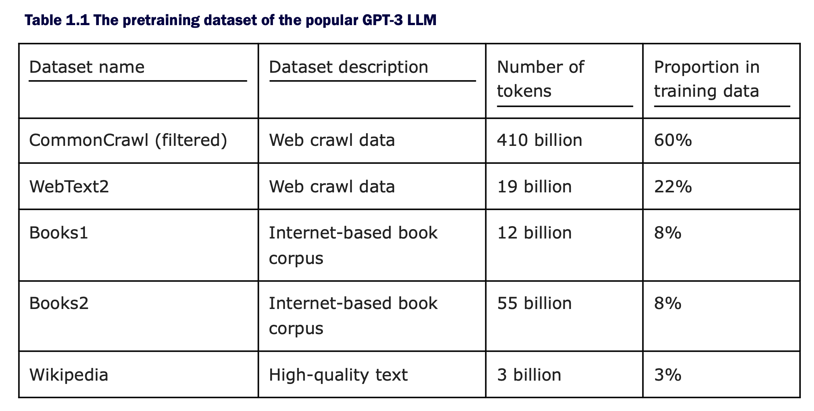
* transformer arch and tasks 
* decoder only approach 
* stages for building an llm p.20 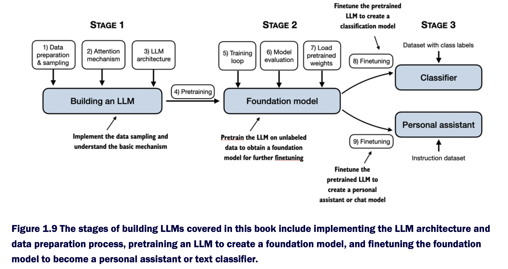
* embedding models 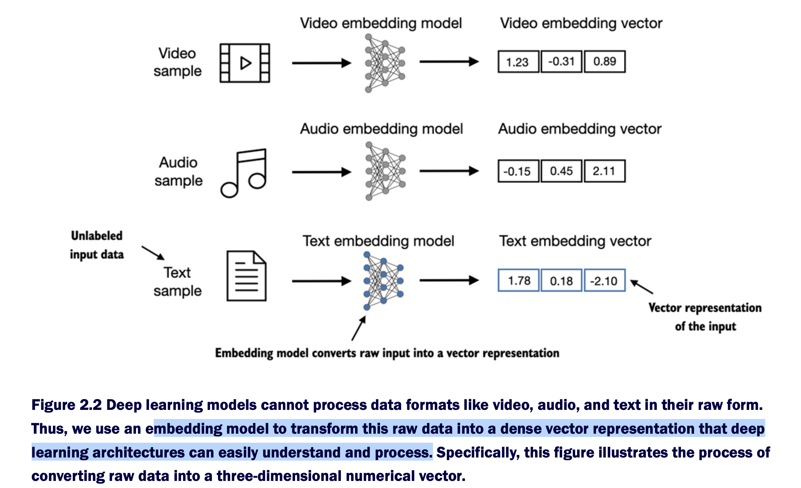
* tokenization process 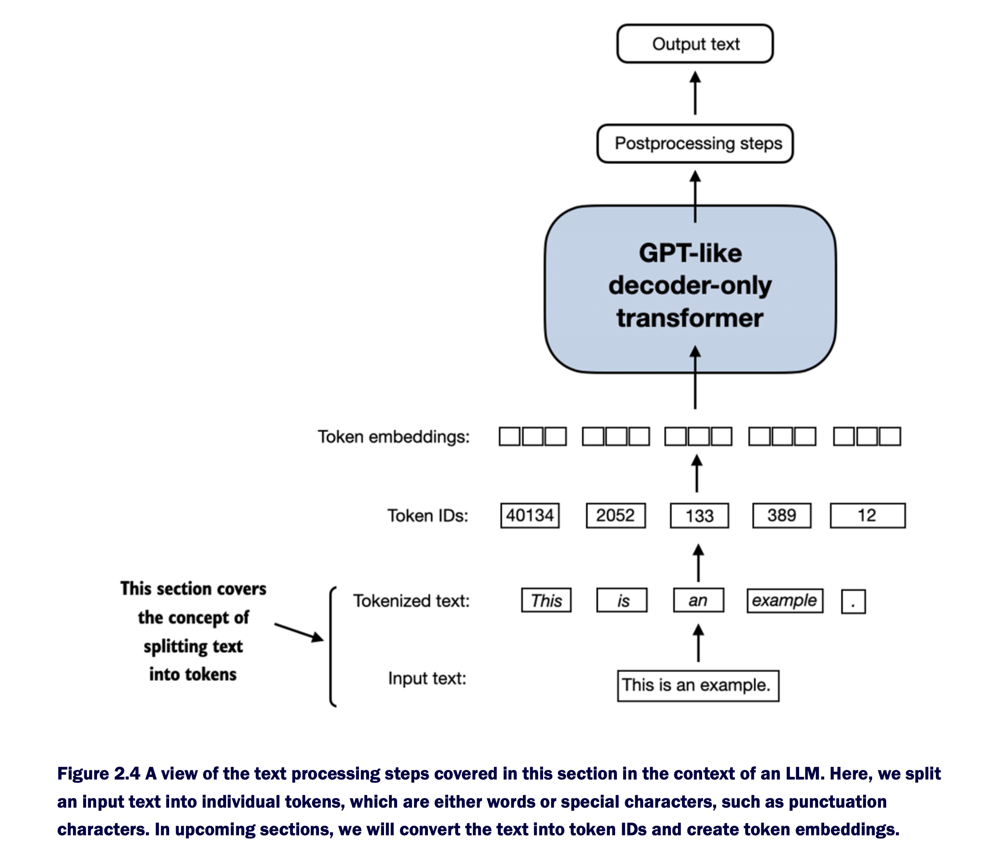
* vocabulary 
* llms predicts next token 
* embeddings layer perform lookup ops 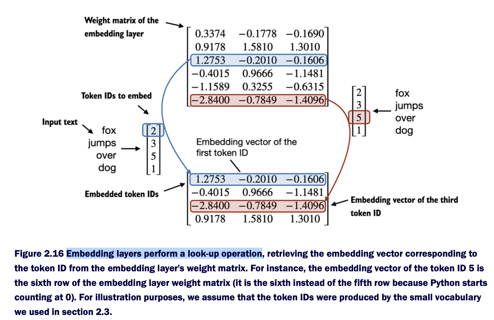
* a note about embedding layer p.58 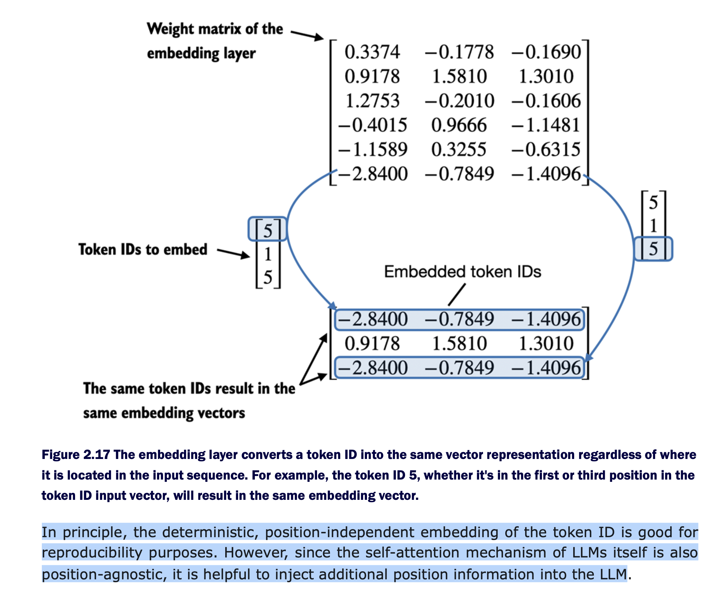
* input embeddings 
* 

# about self attention
* self attention mechanism 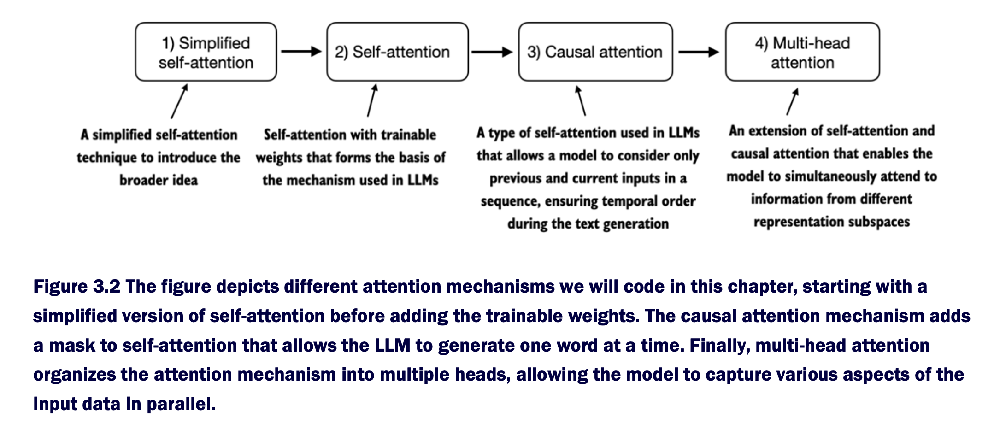
* about RNNs p.67 
* rnns continuation 
* note on scaled dot product attention 
* about q,k,w matrices 
```python
# a simple implementation of the attention mechanism
class SelfAttention_v1(nn.Module):

    def __init__(self, d_in, d_out):
        super().__init__()
        self.W_query = nn.Parameter(torch.rand(d_in, d_out))
        self.W_key   = nn.Parameter(torch.rand(d_in, d_out))
        self.W_value = nn.Parameter(torch.rand(d_in, d_out))
        """
        note: you should use nn.Linear
        because it give weight_initialization, and __apply__ defaults to matrix multplication
        when bias unit disabled.
        ex.
        self.W_query = nn.Linear(d_in, d_out, bias=qkv_bias)
        queries = self.W_query(x)
        """

    def forward(self, x):
        keys = x @ self.W_key
        queries = x @ self.W_query
        values = x @ self.W_value
        
        attn_scores = queries @ keys.T # omega
        attn_weights = torch.softmax(
            attn_scores / keys.shape[-1]**0.5, dim=-1
        )

        context_vec = attn_weights @ values
        return context_vec

torch.manual_seed(123)
sa_v1 = SelfAttention_v1(d_in, d_out)
print(sa_v1(inputs))
```
* summarization of the simple self attention mechanism 


# about different LLms arch
note: base on [article](https://magazine.sebastianraschka.com/p/the-big-llm-architecture-comparison)
* multihead vs grouped query attention 
* multihead latent attention (mla) 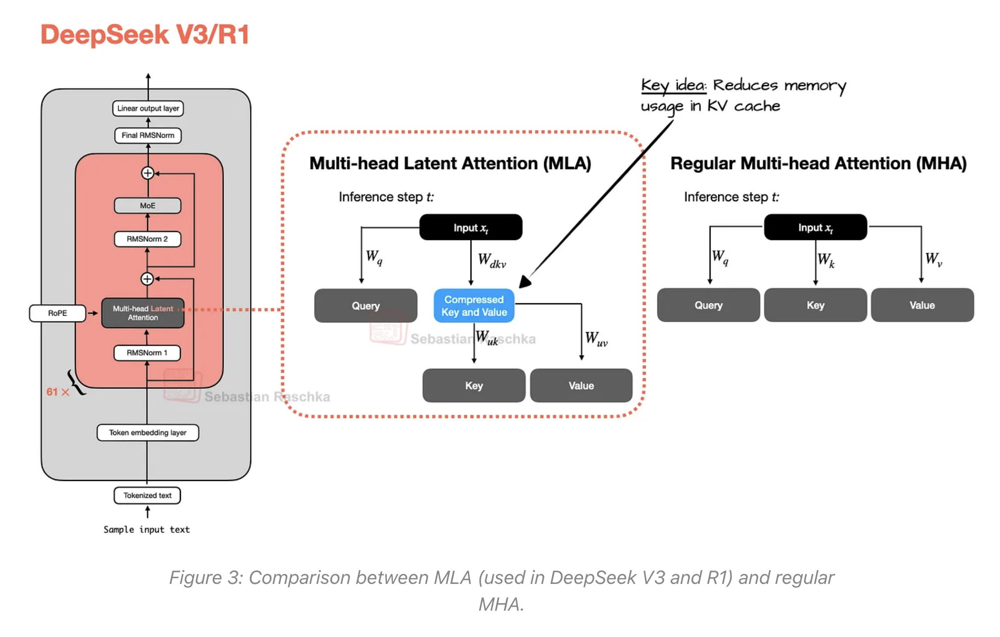
* mixture of experts (MoE) 
* types of MoE 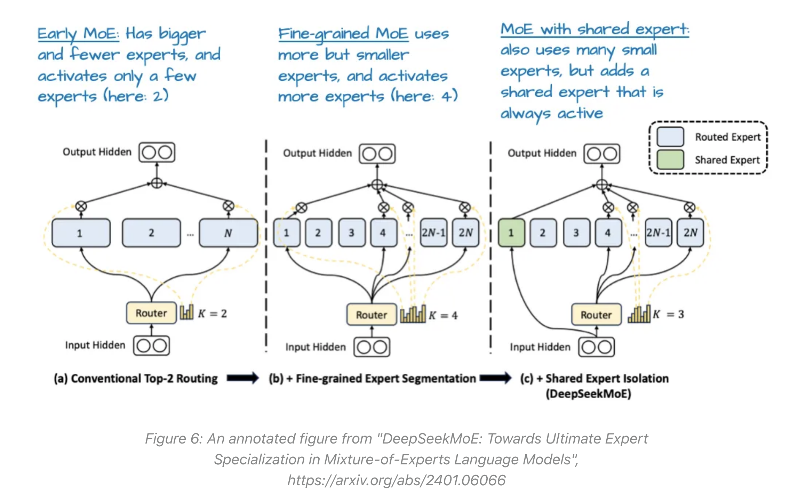
* post-normalization, pre-norm, and olmo 
* llama3 vs olmo2 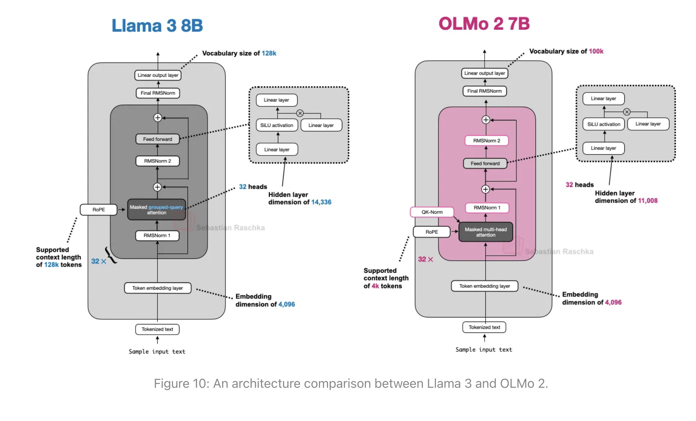
* sliding attention (in the gemma models) vs normal 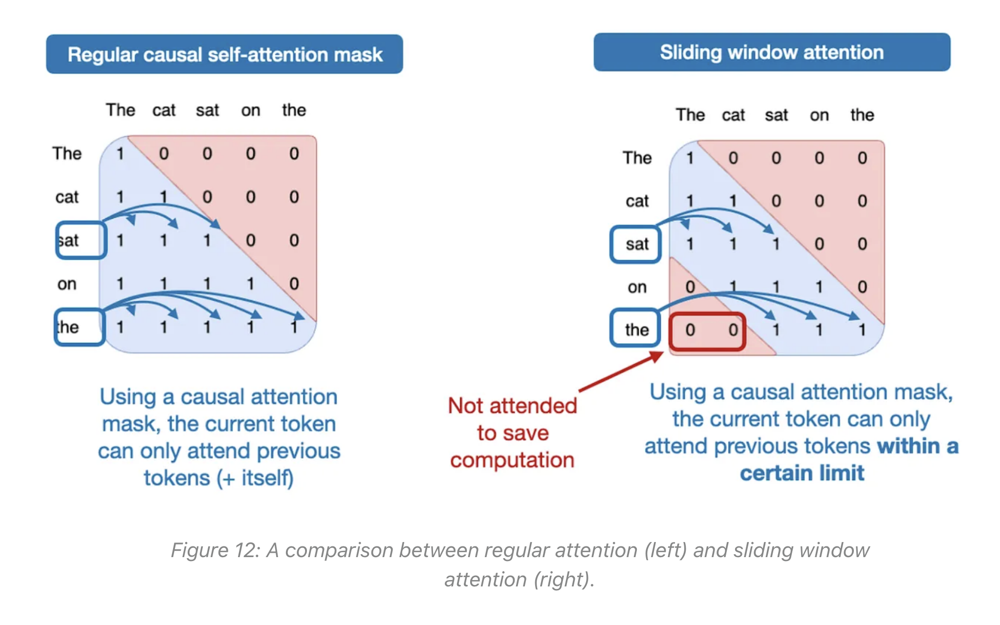
* olmo vs gemma3 arch comparison 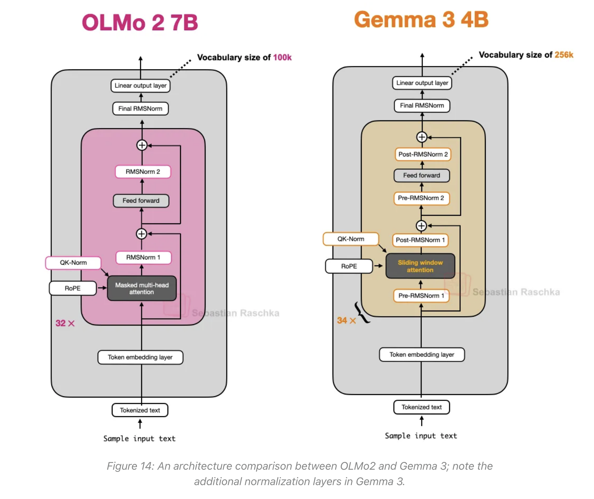
* gemma3 vs mistral 3.1 arch 
* llama3.2 vs qwen3 
* deepseekv3 vs Qwen3 
* smollm3 vs qwen3 
* about NoPE(no positional encodings)
* gptoss 

# notes
* **about embeddings**: while word embeddings are the most common form of text embedding, there are also
embeddings for sentences, paragraphs, or whole documents. Sentence or paragraph
embeddings are popular choices for retrieval-augmented generation. Retrieval-augmented
generation combines generation (like producing text) with retrieval (like searching an
external knowledge base) to pull relevant information when generating text, which is a
technique that is beyond the scope of this book